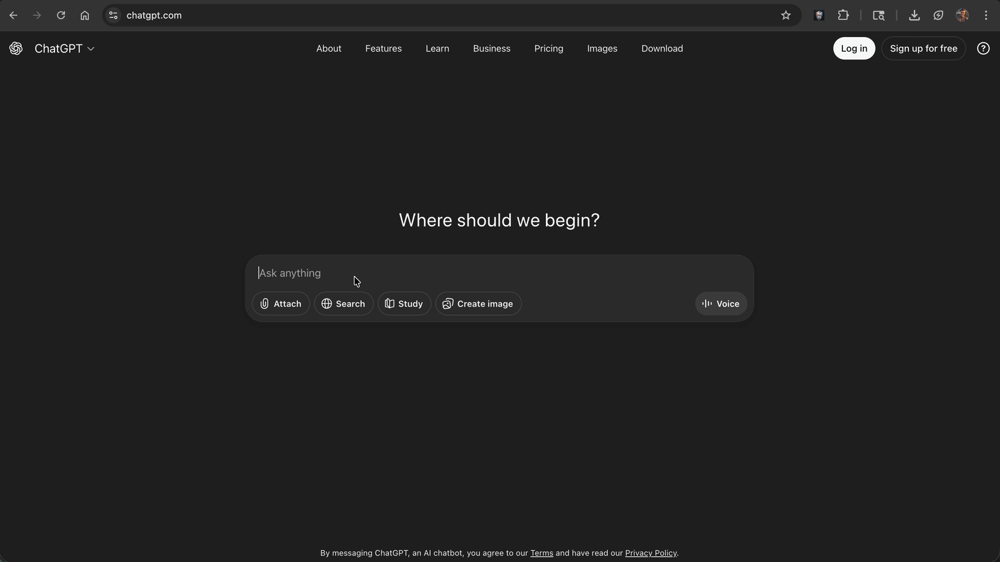
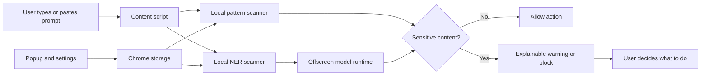
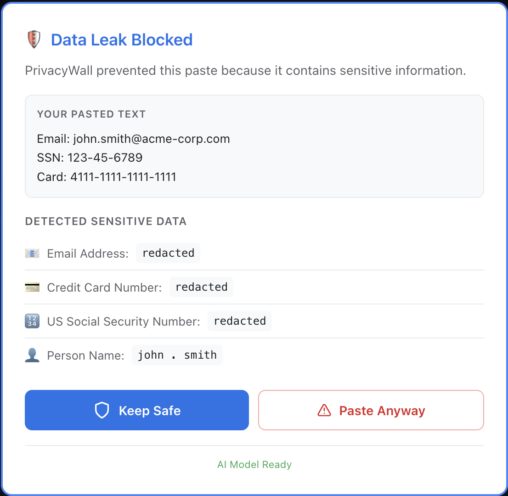
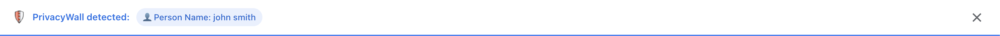
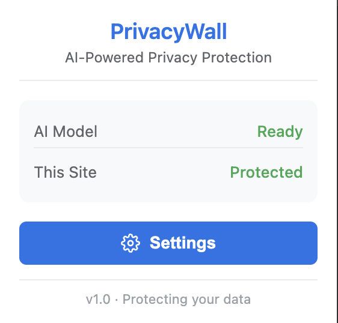
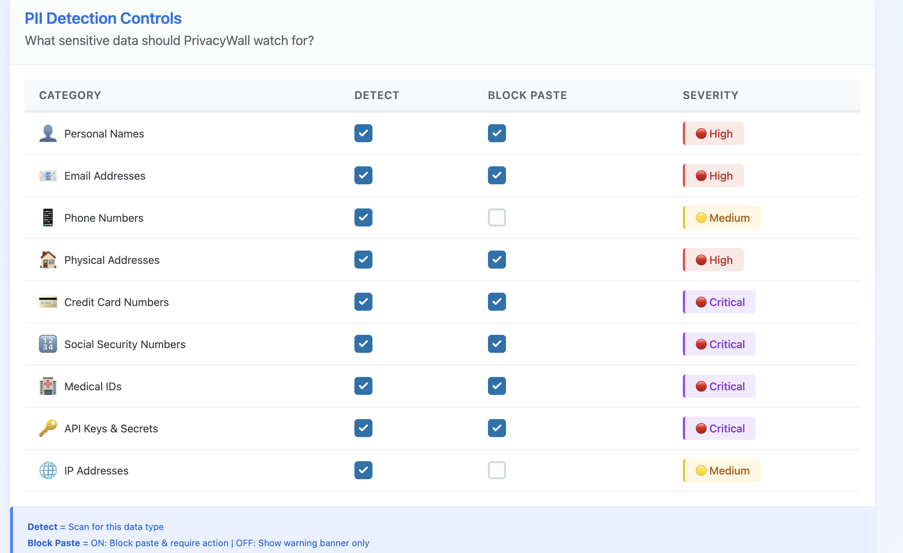

# GATEKEEP.AI

## A local privacy firewall for safer AI use

<p align="center">
  
</p>

<p align="center">
  
</p>

**GATEKEEP.AI** is a Chrome extension that helps prevent users from accidentally pasting personally identifiable information (PII), credentials, and other sensitive content into browser-based AI tools. It scans text locally in the browser, warns or blocks before submission, and provides an explainable reason for the intervention.

> **Idea submission:** Give every AI prompt a privacy checkpoint before sensitive information leaves the user’s browser.

## Problem

People increasingly paste customer records, source code, credentials, internal documents, and personal information into public AI interfaces. Conventional data-loss-prevention tools are often enterprise-heavy, server-dependent, or disconnected from the point where the data is submitted. A user may not realize that a prompt contains an email address, phone number, token, private key, or named person until after the data has already been shared.

## Proposed solution

GATEKEEP.AI places a privacy checkpoint directly inside supported AI websites. It combines two local detection layers:

1. **Pattern detection** identifies structured secrets and PII such as email addresses, phone numbers, payment-card patterns, IP addresses, JWTs, and private-key headers.
2. **On-device named-entity recognition** identifies less-structured entities such as person names, organizations, and locations when the local model is available.

Depending on the user’s settings, the extension can warn the user or block the action. A future redaction workflow can replace detected values with safe placeholders. The design goal is that sensitive text is inspected at the point of interaction rather than sent to a GATEKEEP.AI server.

## Why it matters

GATEKEEP.AI is designed for students, developers, researchers, and organizations that use AI tools but need a practical last-mile privacy control. It addresses accidental data exposure at the user interaction layer without requiring a project backend or a separate enterprise gateway.

## Current capabilities

- Chrome Manifest V3 extension architecture.
- Paste and typing interception on configured AI websites.
- Fast pattern-based scanning for common sensitive-data formats.
- Optional local Transformer-based named-entity detection.
- Warning banner and blocking modal user experiences.
- Popup and settings pages for behavior and detection preferences.
- Protected-site configuration for supported AI services.
- Offscreen-document execution for the browser-side model.
- No project backend or telemetry service.
- Local settings and auditable source code.

The AI model is downloaded by the browser runtime on first use when it is not already cached. This is different from sending scanned prompt text to a remote GATEKEEP.AI server.

## Architecture



## Privacy boundary

GATEKEEP.AI is intended to process scanned text locally in the browser. The repository does not contain a project backend, analytics endpoint, or application API key. The model runtime may contact its model provider when downloading model assets on first use, depending on the browser cache and deployment configuration. Users should verify network behavior in their own environment before making an offline or zero-network claim.

GATEKEEP.AI is a preventive privacy aid. It is not a guarantee that sensitive information can never leave a device, and it does not replace organizational policy, access controls, or a complete enterprise DLP system.

## Screenshots

<table>
  <tr>
    <td align="center" width="50%">
      <br>
      <strong>Paste Blocked</strong><br>
      <em>Sensitive data detected with highlighting</em>
    </td>
    <td align="center" width="50%">
      <br>
      <strong>Typing Warning</strong><br>
      <em>Real-time detection as you type</em>
    </td>
  </tr>
  <tr>
    <td align="center">
      <br>
      <strong>Extension Popup</strong><br>
      <em>Quick status and settings access</em>
    </td>
    <td align="center">
      <br>
      <strong>Settings Page</strong><br>
      <em>Full control over detection rules</em>
    </td>
  </tr>
</table>

<p align="center">
  
</p>

## Supported detection examples

| Detection layer | Examples |
|---|---|
| Pattern rules | Email addresses, phone numbers, payment-card patterns, SSN-like patterns, AWS-style keys, JWTs, private-key headers, IP addresses, MAC addresses |
| Local NER model | Person, organization, and location entities |
| User controls | Enable or disable rules, warning or blocking behavior, protected sites, confidence threshold, typing detection |

Detection patterns are heuristics. They can produce false positives and false negatives. Do not use the prototype as the sole control for regulated or safety-critical data.

## Technology stack

- Chrome Manifest V3
- JavaScript ES modules
- `@huggingface/transformers`
- ONNX Runtime Web / WebAssembly
- Chrome Offscreen Documents API
- Shadow DOM UI isolation
- Node.js and esbuild

## Repository structure

```text
src/extension/
├── manifest.json
├── background.js
├── content-script.js
├── offscreen.js
├── offscreen.html
├── build.js
├── lib/
│   └── transformer-detector.js
├── modules/
│   ├── config.js
│   ├── scanner.js
│   ├── event-handlers.js
│   ├── settings.js
│   └── ui/
└── ui/
    ├── popup.html/js/css
    └── settings.html/js/css
```

## Run locally

### Prerequisites

- Node.js 18 or newer.
- Google Chrome 120 or newer is recommended because the prototype uses the Offscreen Documents API.
- Internet access may be required on first model load unless the model is already cached.

### Build the extension

```bash
git clone https://github.com/gokulrajmisox/GATEKEEP.AI.git
cd GATEKEEP.AI/src/extension
npm ci
npm run build
```

The build output is created in `src/extension/dist/` and is intentionally ignored by Git.

### Load it in Chrome

1. Open `chrome://extensions`.
2. Enable **Developer mode**.
3. Choose **Load unpacked**.
4. Select `src/extension/dist/`.
5. Open an enabled AI website and test with synthetic values only.

Example test input:

```text
Contact demo.user@example.com about ticket 555-0100.
```

Do not test with real credentials, private keys, customer data, or production secrets.

## Idea-submission positioning

### Suggested title

**GATEKEEP.AI: A Local Privacy Firewall for Resilient and Responsible AI Interaction**

### Short pitch

GATEKEEP.AI is a browser-level privacy firewall that detects PII and secrets before users submit prompts to AI tools. It combines fast pattern matching with optional local named-entity recognition, then warns or blocks the action with an explainable reason. Because the scan is performed at the point of interaction and the project has no application backend, it offers a practical, low-friction control for reducing accidental data exposure during everyday AI use.

### Differentiation

The project is not another chatbot or document scanner. Its key design decision is **pre-submission enforcement at the browser interaction boundary**. This makes the control visible to the user at the moment of risk and avoids requiring every organization to integrate a separate server-side gateway.

### Demonstration flow

1. Open the extension settings and enable the pattern and local-NER detectors.
2. Paste a synthetic email address and phone number into a supported AI site.
3. Show the highlighted detection and explain why the action is blocked or warned.
4. Paste a synthetic person or organization name to demonstrate the local NER layer.
5. Change the policy from blocking to warning and repeat the test.
6. Open the settings page to show configurable rules and protected sites.
7. Inspect the browser network panel and explain the model-download behavior separately from prompt scanning.

### Proposed evaluation

| Measure | Evaluation method |
|---|---|
| Pattern precision and recall | Labeled synthetic corpus containing positive and negative examples |
| NER precision and recall | Labeled sentences covering names, organizations, and locations |
| Intervention latency | Time from paste/input event to warning or block |
| False-positive rate | Benign prompts containing numbers, names, and code-like strings |
| Coverage | Number of supported AI sites and input mechanisms tested |
| Privacy behavior | Network inspection and source-code review during scanning |
| Usability | User study measuring correction time and unintended submission rate |

No performance number should be claimed until it has been measured on a documented test set and browser configuration.

## Limitations

- Browser DOM changes can break site-specific input handling.
- Pattern rules are heuristic and are not complete secret detection.
- The local NER model can miss entities or produce false positives.
- Model assets are not bundled in this repository and may be downloaded on first use.
- The prototype is currently focused on Chromium-based browsers.
- A browser extension cannot control data submitted outside the configured browser context.

## Roadmap

- Add a reviewed redaction mode that replaces detected values with safe placeholders.
- Add custom organization rules and importable policy profiles.
- Add Firefox support after a compatibility review.
- Add deterministic automated tests for each detection rule and supported input type.
- Add an offline model packaging option with documented asset licensing.
- Add exportable, privacy-preserving intervention statistics that users explicitly enable.
- Add enterprise policy deployment documentation.

## Contributing

Issues and pull requests are welcome. When reporting a problem, include the browser version, operating system, protected site, reproduction steps, expected behavior, and actual behavior. Never include real secrets or personal data in an issue, screenshot, or test fixture.

## License

This project is licensed under the [MIT License](LICENSE).

The third-party dependencies and model assets used by the project may have separate licenses. Review their respective license files and model cards before redistribution.

## Links

- [Source repository](https://github.com/gokulrajmisox/GATEKEEP.AI)
- [Issue tracker](https://github.com/gokulrajmisox/GATEKEEP.AI/issues)
- [MIT License](LICENSE)


